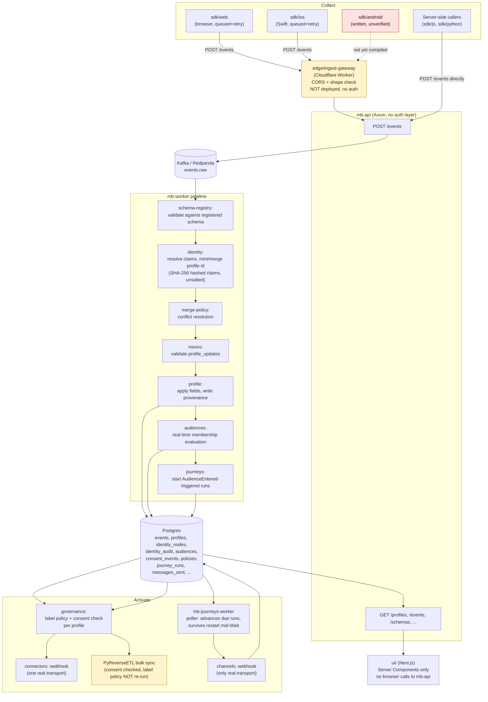
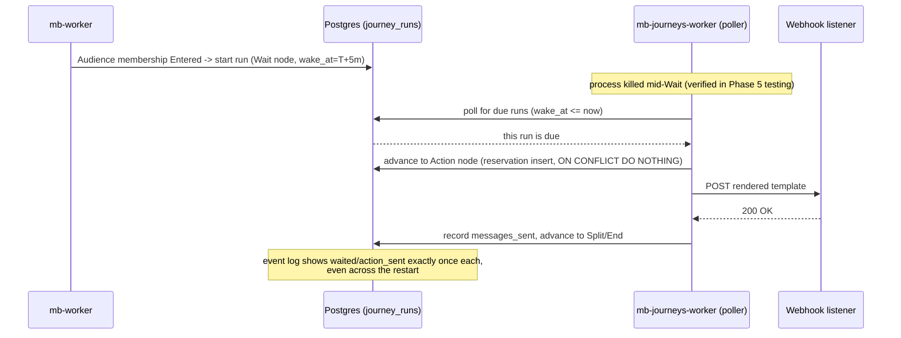

# Architecture diagrams

This is a diagram-only companion to `docs/ARCHITECTURE.md`, which is the canonical, detailed,
phase-by-phase description of what's built vs. deferred and why. Read that file for the real
narrative — including caveats, verified end-to-end scenarios, and explicit "not built" sections.
These diagrams exist to make the shape of the system scannable in ten seconds; they intentionally
omit the nuance the prose version is careful about, so don't treat a box on a diagram as proof a
feature is production-ready.

## Data flow: collect → standardize → resolve → project → activate

**Key, since color alone shouldn't carry meaning:** boxes marked with a dashed line or explicit
label text ("NOT deployed", "unverified", "NOT re-run") are disclosed gaps, not implied failures —
cross-reference `docs/ARCHITECTURE.md`'s "What's explicitly NOT built yet" section and
`ROADMAP_HONEST.md`'s security findings for what each one means in practice. In particular: there
is no authentication anywhere on the `mb-api` box, and `tenant_id` isolation is enforced only by
application-level query filtering, not a database or gateway-level boundary — see `SECURITY.md`.

## Journey durability (Phase 5, verified by restart test)

## What these diagrams do not show

- Auth/authz (there isn't any — see `SECURITY.md`)
- Multi-tenant isolation boundaries (none exist beyond a `tenant_id` column filter)
- The governance policy simulator (`POST /policy-simulate`), which reuses the same evaluation code
  as real activation but never touches `Postgres` state — see `docs/ARCHITECTURE.md` Phase 4
- Any of the "not built" systems (decisioning, AI agents, real SMS/email/push channels, a CLI) —
  they're absent from these diagrams because there is no code to diagram, not because they were
  cut for space
